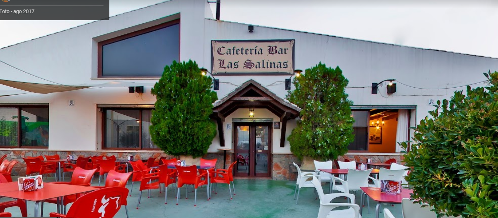
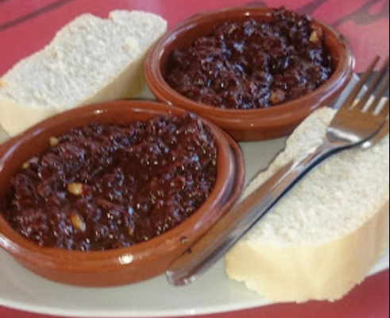
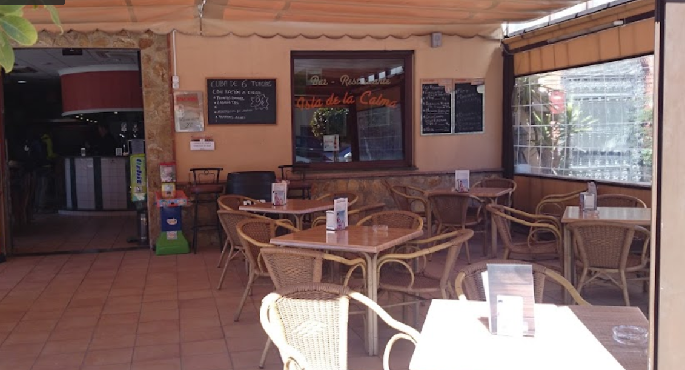

Hay muchos sitios donde se come muy bien:

<h1>Isla de la Calma</hi>

Mi recomendación, se come bastante bien, pero hay que coger coche si o si. Luego tenemos el pantano al lado si queremos ir.

<h1>Santa Teresa</h1>

Simplemente, con la bebida ponen tapas, con 3 estás cenado y lo mejor que le veo es que se puede ir andando porque está al lado

<h1>Isla de la Calma</hi>

Ponen comida muy buena, los menus salen bastante bien, está al lado del Cine/Bolera.

Hay otros sitios también, se verá sobre la marcha