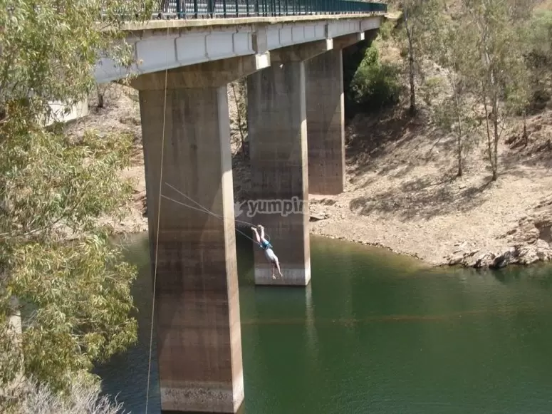
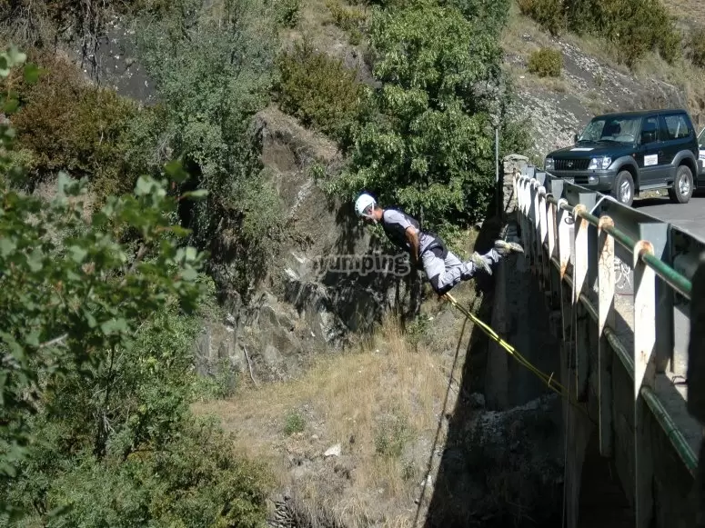

A ver, quiero gente que le eche huevos y ovarios al asunto que si puedo yo con mi pánico a las alturas tiro a quien sea conmigo.

tenemos puenting al lado en aznalcóllar y otros pantanos/puentes. Podemos ir a los de la empresa [yumping](https://www.yumping.com/ofertas/puenting/sevilla/puenting-en-aznalcollar-1-salto--o9954)

Aunque apuesto que por groupon u otros sitios encontramos alguna oferta.

El puente es de 20 metros de altura, la caida solo son 15m hasta que te retiene la cuerda y luego de ahí los 5 metros que quedan te bajan y te recogen en piragua.

De todas formas son 25€ por una experiencia que solo dura unos segundos (un segundo salto son 10€ más).

