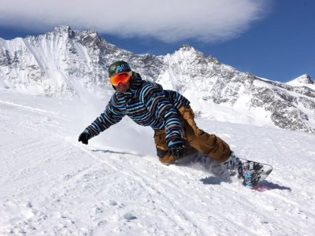
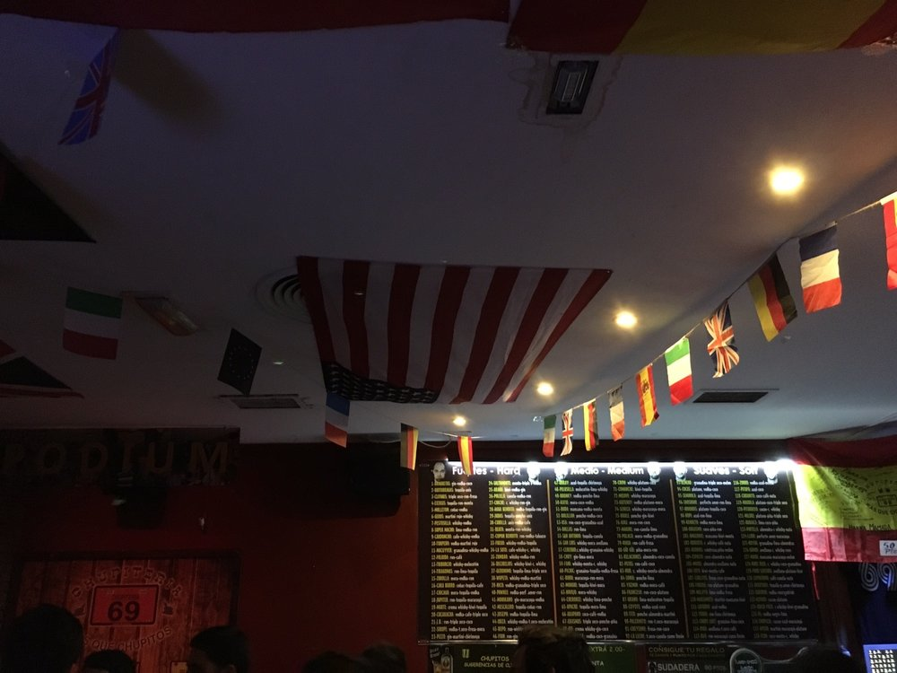

La idea es ir a Sierra Nevada, le pagamos a Marta el Forfait (45-50€, menos si cogemos una oferta) y ella nos enseña.

Hay cupones en [Groupon](https://www.groupon.es/) y otras páginas del estilo que podríamos aprovechar y sin contar gasolina nos puede salir la broma por 40-60€ todo el día o menos (es cuestión de buscar). Estar atentos a [Chollometro](https://www.chollometro.com/)

Que no se diga que Granada está al lado y ya tenemos la experiencia de lo que es pasar un finde allí y la fiesta que se mueve.

Queremos ver el reencuentro de Fran y Paula.