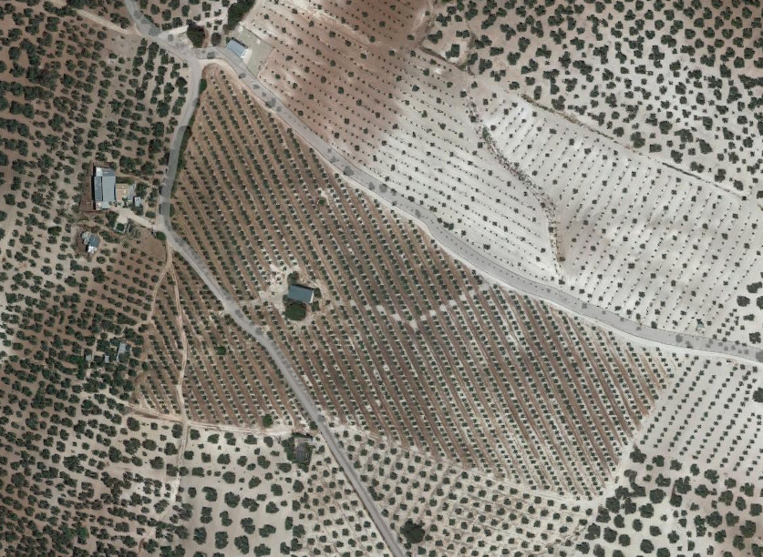

---
# Feel free to add content and custom Front Matter to this file.
# To modify the layout, see https://jekyllrb.com/docs/themes/#overriding-theme-defaults

layout: page
---

Welcome to AloePacci's Main Page

you can split this github account rn in 4 different spaces:

